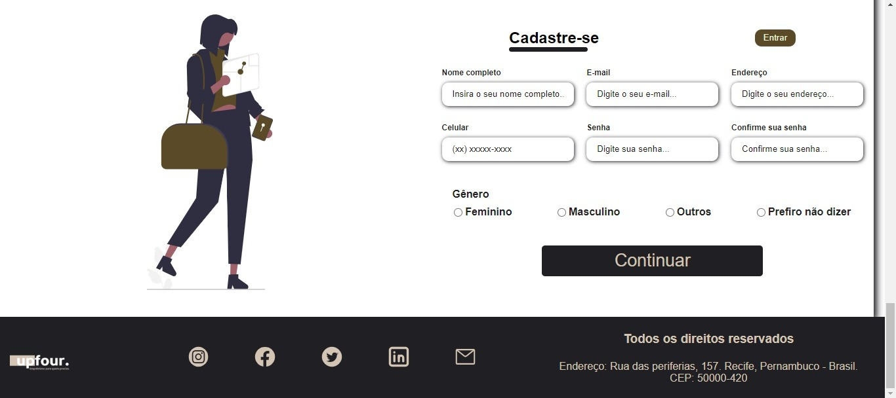
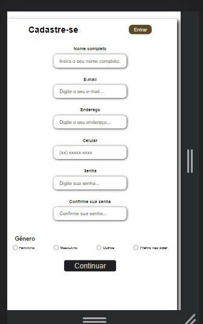

# PROJETO Landing-Page - Upfor: Periferia no centro

Nesse projeto, o objetivo foi de criar uma **Landing Page**, cujo objetivo é apresentar cases de sucesso e aproximar mais pessoas da periferia para abrir o seu negócio. Essa é a minha primeira Landing-page, foi uma experiência importante nesse aprendizado. 

## Índice

- <a href="#sandra-gil"> O que fazemos</a>
- <a href="#credito">Crédito para o seu negócio</a>
- <a href="#cadastre-se">Cadastre-se</a>

## O que praticamos na construção da landing page?
Para a construção desse site, foram usados os seguintes conteúdos:
* HTML
* CSS
	* Flex
	* Grid
* DOM

## Funcionalidades do projeto

- Cadastro de novos usuários
- Redirecionamento interno
- Redirecionamento global

## Layout

### Tela de Computador

*Parte inicial do nosso site em um computador*

*Formulário e redes sociais do nosso site*
  
### Tela do celular

## Lista de requisitos cumpridos
A sua Landing Page deve conter:

- [X] **Uma seção inicial ou principal:** Esta é a seção que visitantes vêem primeiro quando acessam seu site. 
	
- [X] **Logomarca:** A logomarca fornecida pelo cliente, que deve ser apresentada de forma clara e em um local estratégico da página.	

- [X] **Paleta de cores:** Uma paleta de cores baseada na logomarca fornecida pelo cliente.	

- [X] **Cabeçalho e Rodapé:** O cabeçalho deve conter informações importantes sobre a sua empresa, como  botões de navegação e opções de contato. Já o rodapé pode incluir informações adicionais, como endereço e links de redes sociais.

- [X] **Redes Sociais:** Incluir pelo menos  2 ícones para redes sociais, visíveis e clicáveis.	

- [X] **Formulário de Contato:** Inclua um formulário de contato para que os visitantes possam se comunicar com a empresa fictícia. O formulário deverá solicitar, no mínimo, um e-mail para contato. (veja um exemplo nesse vídeo: https://coda.io/d/_duQBJ-J3TJr/Funcionalidades_suFtt#_lu2rX)

- [X] **Responsividade:** Sua landing page deve ser responsiva e adaptável a diferentes tamanhos de tela, como smartphones e desktops. Além disso, é importante testar sua landing page em diferentes dispositivos, como o iPhone 6/7/8 para a versão mobile, e em uma tela de 1280px de largura para a versão desktop.

- [X] **Botões:** Todos os botões devem estar funcionando com alguma lógica javascript.	

- [X] **Seções:** Conter, pelo menos, 2 seções diferentes.	

